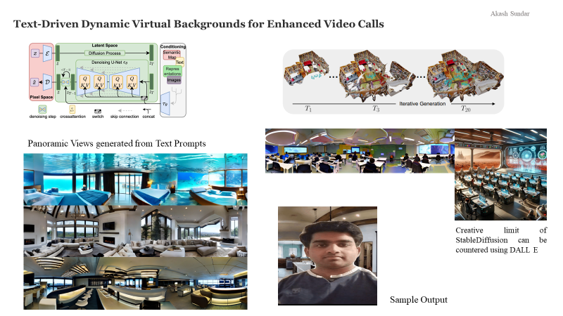

# Text-driven-Dynamic-Virtual-Background

Implemented a Stable diffusion based Text2Scene pipeline, achieving a 67 \% improvement in consistent scene generation \& generated panoramic images with photo realism rated at 8/10. Optimized the Neural Radiance Fields (NeRF) pipeline by introducing cross-patch attention mechanisms resulting in 12.8\% increase in FID score.

 
 
